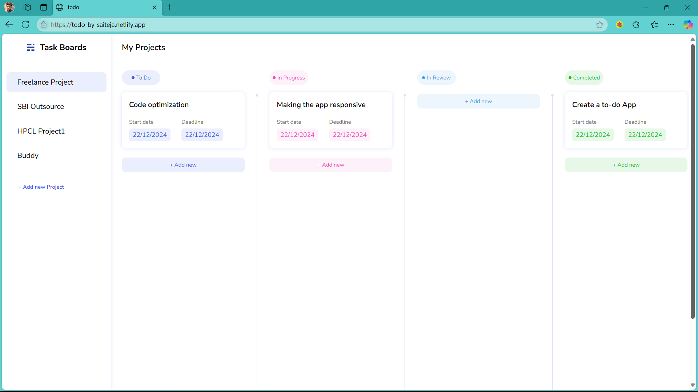
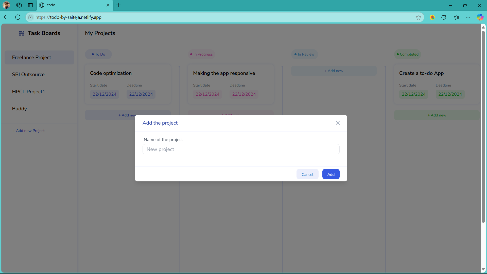
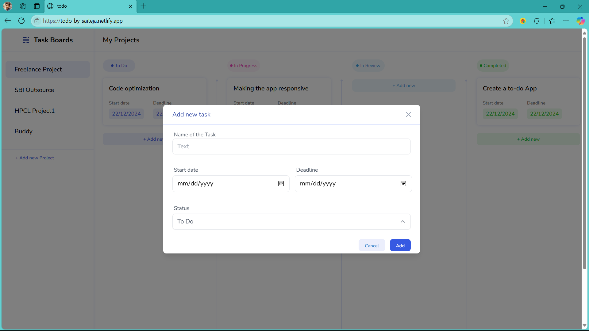

# Todo App 📝

Welcome to the **Todo App**! This is a full-stack application built using:

- **Frontend**: React.js ⚛️
- **Backend**: Node.js 🌐
- **Database**: MySQL 🗄️
- **Styling**: Tailwind CSS 🎨

This app helps users manage their tasks efficiently by organizing them into projects, providing a task board view, and enabling easy task addition, editing.

---

## 🌟 Features

### 📂 Project Management
- Add  projects to organize your tasks better.

### ✅ Task Management
- Add new tasks under specific projects.
- Edit task details, including status and due date.

### 🗂️ Task Board
- View tasks in a board format categorized by their status (To Do, In Progress, In Review, Completed).

### 🌈 Modern UI
- Sleek, responsive design with **Tailwind CSS**.
- Easy navigation and user-friendly interface.

---

## 🚀 Deployed Link
Check out the live version of the app here: [Todo App Live](https://todo-by-saiteja.netlify.app/) 🌍

---

## 🖼️ Screenshots

### Task Board

### Add Project

### Add Task

### Edit Task

---

## 🛠️ Tech Stack

### Frontend
- React.js ⚛️
- Tailwind CSS 🎨

### Backend
- Node.js 🌐
- Express.js 🚀

### Database
- MySQL 🗄️

---
Enjoy using the Todo App! 🚀

  
